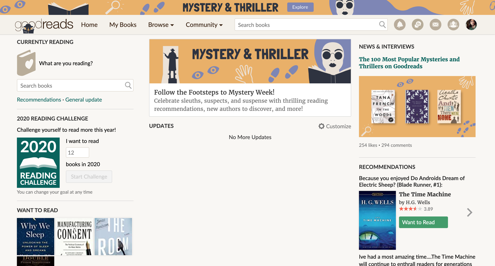
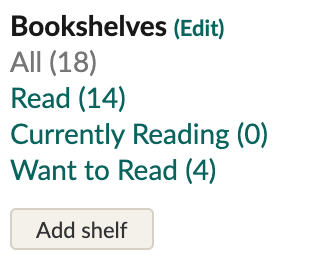
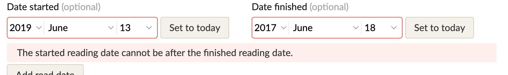
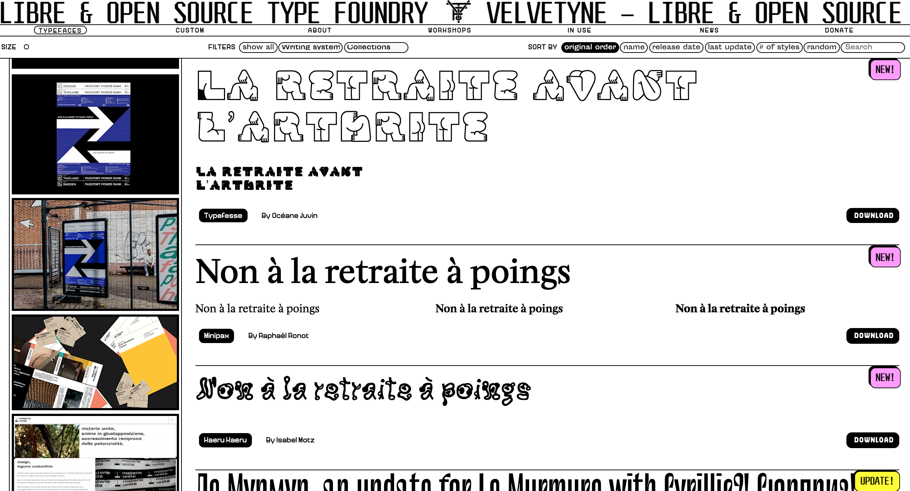
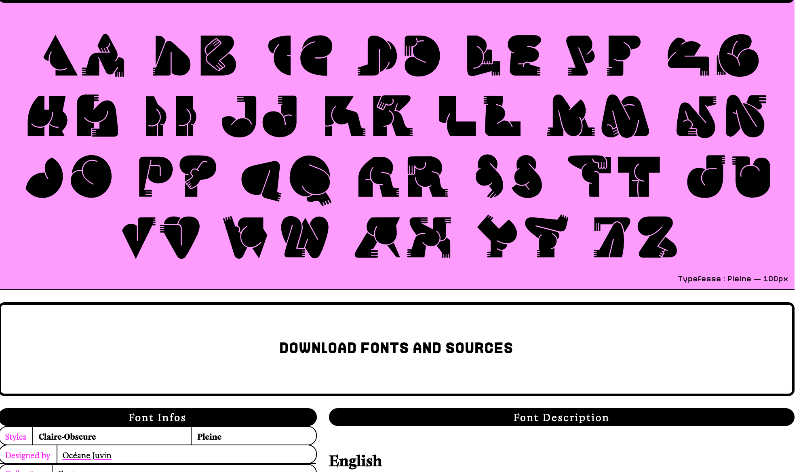

# Tentative title: DH 150 redesign project
## meganmai-dh150
Megan Mai, DH 150 
### Goal 
I aim to redesign goodreads and Velvetyne's full-view font page. Specifically, the goodreads page need to be simplified/modularized. There is too much information conveyed all at once on one page; there are more options than any user would need to see all at once. There should be only a few navigation options that would encapsluate other options (logically categorized). On the other hand, velvetyne's page needs a more straightfoward navigation for the full-view of the font. It is not clear what the user needs to do to download the font, edit the example text, or view the text in full.
## Goodreads Page                                  

### Description
Goodreads is a book tracker/online bookclub social media platform. It is a way for users to track their progress and find new reads. 
### Overall Evaluation
As pictured above, there are many seasonal events and features that are on display at all times on every page for the user to see. Despite it's consistent presence, I believe this may spur users to actively ignore these often unwarranted suggestions. Additionally, options to plan a reading list, update your profile on what you are reading, and a list of books in progress are also displayed on the same page. 
### Heuristic Evaluation
Goodreads does a decent job of maintaining visibility of system status. Users know what tab they are on by checking the tab list on the left:
#

#
And looking for the grey text.
This page does fall short in matching the system with the real world, however, because there are two symbols indicating some type of communication: there is an envelope for messaging, and message bubbles for discussion board. Both symbols are used interchangaeably to indicate messaging systems on other platforms, and it takes a bit of experience to tell what does what.
#
	

# 

In terms of supporting undo and redo, readers are prone to accidentally adding book to their list due to high presence of 'add book' buttons. When a book is added, the user must go to an entirely separate page, relocate the book added, and then remove it from their's profile.
# 

#
The consistency and standards of Goodreads are good. The terminology used is relatively straightforward, for example, read books are labeled under the tab 'read', and in-progress books are listed as 'currently reading'.
#
The prevalence of the 'add book' button on the website also contributes to a lack of error prevention. There are no second checks when the user adds a book. This can lead to an accumlation of accidentally added books.
#
Goodreads handles recognition well. Next to each category of book (read, unread, etc) there is a count indicating how many books are in the category. Users will know if the category has been successfully updated. 
#
The effeciency of use of Goodreads isn't necessarily bad; there are no tailored shortcuts because all navigation options are presented on the page, giving the user easy access to most actions while also crowding the space.
#
The primary violation is in regards to the heuristic of aesthetic and minimalist design. The page is flooded with extraneous and non-vital information. There are several seasonal events that could be allocated under one tab, as well as the option to plan, update, and list any reads.
#
Error recognition in implemented when the user tries to set the starting date of reading a book to before the finish date. The website notifies them as such:
#

#
Good reads does not provide good documentation, seemlying on account of the fact that much of the website is displayed plain in sigh on every page. Nevertheless, there are no intial directions on how to operate the platform, which, despite its transparency, is still quite difficult to navigate.
### Severity Ranking 
3: Aesthetic and minimalist design. The website is in sore need of simplification. There is too much information on the page, and while the user has many options ot choose, bring, this can confuse and distract user intention, and is also unsightly. The website would improve greatly with a more modular design, with only a few option a page, each option encapsulating further options.
2: The 'add book' feature violates user control and freedom and error prevention. When deep in browsing books, it is very irritating having to return to my shelf to remove accidentally added books, and is a significant detour in browsing for new books. 
1: Goodreads would benefit from proper documentation. The addition of guidelines would make an already straight foward website even easier to navigate.

## Velvetyne Page  

