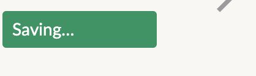

# Tentative title: DH 150 redesign project
## meganmai-dh150
Megan Mai, DH 150 
### Goal 
I aim to redesign goodreads and Velvetyne's full-view font page. Specifically, the goodreads page need to be simplified/modularized. There is too much information conveyed all at once on one page; there are more options than any user would need to see all at once. There should be only a few navigation options that would encapsluate other options (logically categorized). On the other hand, velvetyne's page needs a more straightfoward navigation for the full-view of the font. It is not clear what the user needs to do to download the font, edit the example text, or view the text in full.
## Goodreads Page                                  

https://www.goodreads.com/
### Description
Goodreads is a book tracker/online bookclub social media platform. It is a way for users to track their progress and find new reads. 
### Overall Evaluation
As pictured above, there are many seasonal events and features that are on display at all times on every page for the user to see. Despite it's consistent presence, I believe this may spur users to actively ignore these often unwarranted suggestions. Additionally, options to plan a reading list, update your profile on what you are reading, and a list of books in progress are also displayed on the same page. 
### Heuristic Evaluation
Goodreads does a decent job of maintaining visibility of system status. Users know what tab they are on by checking the tab list on the left:
#

#
And looking for the grey text.
This page does fall short in matching the system with the real world, however, because there are two symbols indicating some type of communication: there is an envelope for messaging, and message bubbles for discussion board. Both symbols are used interchangaeably to indicate messaging systems on other platforms, and it takes a bit of experience to tell what does what.
#
	

# 

In terms of supporting undo and redo, readers are prone to accidentally adding book to their list due to high presence of 'add book' buttons. When a book is added, the user must go to an entirely separate page, relocate the book added, and then remove it from their's profile.
# 

#
The consistency and standards of Goodreads are good. The terminology used is relatively straightforward, for example, read books are labeled under the tab 'read', and in-progress books are listed as 'currently reading'.
#
The prevalence of the 'add book' button on the website also contributes to a lack of error prevention. There are no second checks when the user adds a book. This can lead to an accumlation of accidentally added books.
#
Goodreads handles recognition well. Next to each category of book (read, unread, etc) there is a count indicating how many books are in the category. Users will know if the category has been successfully updated. 
#
The effeciency of use of Goodreads isn't necessarily bad; there are no tailored shortcuts because all navigation options are presented on the page, giving the user easy access to most actions while also crowding the space.
#
The primary violation is in regards to the heuristic of aesthetic and minimalist design. The page is flooded with extraneous and non-vital information. There are several seasonal events that could be allocated under one tab, as well as the option to plan, update, and list any reads.
#
Error recognition in implemented when the user tries to set the starting date of reading a book to before the finish date. The website notifies them as such:
#

#
Good reads does not provide good documentation, seemlying on account of the fact that much of the website is displayed plain in sigh on every page. Nevertheless, there are no intial directions on how to operate the platform, which, despite its transparency, is still quite difficult to navigate.
### Severity Ranking 
3: Aesthetic and minimalist design. The website is in sore need of simplification. There is too much information on the page, and while the user has many options to choose from, this can confuse and distract user intention, and is also unsightly. The website would improve greatly with a more modular design, with only a few option a page, each option encapsulating further options.
2: The 'add book' feature violates user control and freedom and error prevention. When deep in browsing books, it is very irritating having to return to my shelf to remove accidentally added books, and is a significant detour in browsing for new books. 
1: Goodreads would benefit from proper documentation. The addition of guidelines would make an already straight foward website even easier to navigate.

## Velvetyne Page  

### Description
Velvetyne is a non-profit repository of fonts and typefaces. Stylistically, there is deliberate chaos, and the usability of the website often is comprimised to execute this aesthetic. However, certain features are quite inaccessible not as a result of the chaotic style of the website, and can be solved without compromising the overall aesthetic.
### Overall Evaluation
Despite it's appearance, Velvetyne is a decently navigatable website, despite its garish appearance. Although the tacky and busy look of the site is deliberate, there are certain aspects of the website that should still be streamline and elegant. The user must be able to find out how to view the text in full and download it as easily as possible. 
### Heuristic Evaluation
Velvetyne fails to maintain the visibility of system status in the few instances that it is need. Since the page is relative simple, there is not much that needs to be kept track of. In typical fashion, any button that is selected triggers an animation or a change in appearance indicating selection. For some selections, it is a strobe effect, for others it simply inverts the color:
Perhaps it would be good to make the selection animation consistent among all buttons.
# 
As the website is not the type of page to be accessed by the masses, Velvetyne's match between the system and the real world is appropriate given the circumstances. There exists no excessively niche jargon, and the language is simply-put. The download button says 'download', etc.
# 
There is no specific feature that supports undo and redo; and the extent of it's implemetation is just that after viewing a text in full, one can return to the prior page at the same point in the catalogue as they were before. In that sense, scrolling through the list and testing the fonts in full can be tedious, as there isn't a quickview to see the entire typeface.
#
Within the website, Velvetyne follows very consistent layouts and operations. Each font is presented identically, with the same functions of download, view sample text, and view and full.
#
There are no measures taken for error prevention. When downloading a font, which can be confusing and convoluting, the user just presses the button, and then the file is downloaded. Additionally, when the same font is downloaded twice there is no indication that the user is creating a duplicate.
#
Velvetyne falls short in Recognition, particularly because one can only download and examine one font at time. It would be extremely helpful to have a feature that displays previously view fonts, or a 'bag' like feature where the user can gather all fonts of interest in one group to be examined comparatively. However, Velvetyne allows the user to customize example text for it to be displated across all fonts:

#
Again, the flexibility of the website would greatly increase with the addition of a feature that allowed the user to gather and compare fonts alongside each other. 
#
Velvetyne certainly does not adhere to minimalist guidelines, however this is deliberate. The page is very visually busy but in reality three things are presented: examples, fonts, and the top navigation bar. Improvements can be made to optimize the layout, but it really isn't as bad as it may seem.
#
Velvetyne offers no error recovery because there aren't many errors to make; at least there aren't any errors that are objectively wrong. Users may hit the wrong font or tab but there is no way for the website to identify it as mistake navigation.
#
Velvetyne could seriously benefit from thorough documentation with it's busy and complicated interface. There are no clear indicators of what is the font name and what is the example text and thus it is really hard to users to find out how to view the font in full text. Velvetyne also does not have a help page.
## Severity Ranking 
3: Recognition need improvements. Make it so users do not need to memorize/open separate tabs to compare two texts of interest.
#
2: In terms of forgivenss, an undo redo-like solution could be implemented where the user looks at the font in a quickview module before proceeding to a full view so as to not immediately leave the browsing page.
#
1: Velvetyne is in need of a help page.

