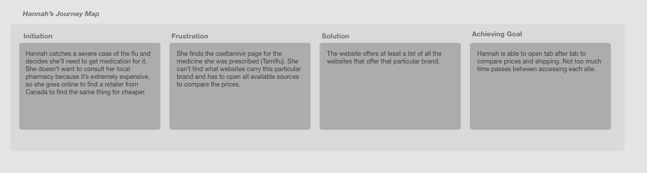
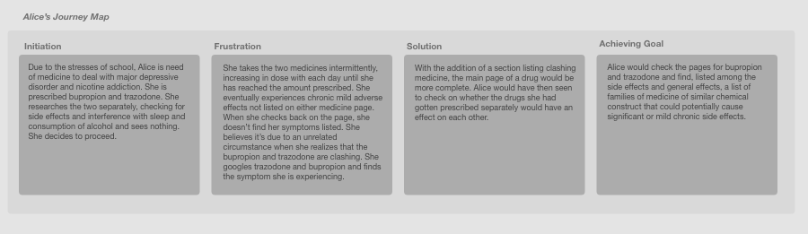
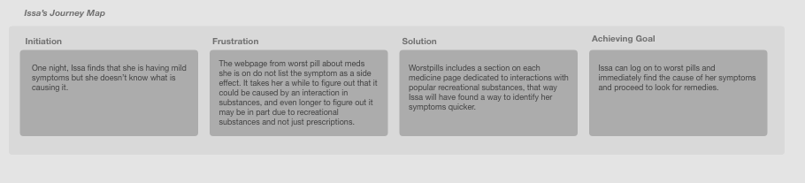

# Assignment 05: Persona + Stories
Megan Mai DH 150
### Features
*** 
##### Main page for generic drug name, with brand names nested within.
###### For example, main page for methylphenidate would contain Adderall, Ritalin, etc. This page would also show up if any of the nest names were the key termed used to search.
##### Page should lead to online retailers. 
###### This may be a bit out of the scope of the use of the site, but the customers should at least be able to see all online retailers on one page to then compare their prices and locations.
##### Mixed drug effects and side effects
###### Must prioritize the potential adverse effects of mixing drugs. Primary feature should display whether the medicine can be taken while drinking or smoking marijuana, and all other brand names that it clashes with.
***
## Persona and Empathy Maps

- Hannah Smtih, Persona #1

- Alice Chen, Persona #2

- Isa Morris, Persona #3

## Scenarios and Journey Maps

### Hannah Smith's Scenario

- Hannah is a proponent of natural medicine who has just warmed up to pharmaceutical medicine. She is extremely skeptical and cautious about the potential pitfalls of using human manufactured remedies. She is also a bit of a hypochondriac, so she frequently finds herself searching symptoms. She catches ur sicknesses early, but does not find herself turning to pharmaceutical medicine until it gets severe enough. This means she tends to turn to antibiotics because given the circumstances of an illness persisting, it's probably going to be quite severe.

- She is at home for break when she notices signs of an onset head cold or flu persisting for three weeks. She goes to the doctor and is prescribed amoxicillin. When she goes home she immediately uses that brand name and searches on worstpills. A pop up appears and shows the categories the medicine falls into (antibiotics) and all of the other generic and brand names the formula shows. There also appears, under the generic name, the main page describing the ingredients that appear in the formula. Hannah proceeds to search for the ingredients to search for any accounts of adverse effects.

### Alice Chen's Scenario
- Alice Chen is a busy third year architect student at the rigorous program at UC Berkeley. She has been prescribed a cocktail of meds from the USHIP psychiatrist and is put off how lenient the school services are with distributing drugs. She feels there was a lack of caution and warnings taken when being prescribed. She wants to find out both any potential side effects that were not disclosed to her and she wants to make sure none of the meds she was prescribed on separate accounts will interfere with each other.

- she goes on the website on her mobile phone, an iPhone 6. The website is relatively straightfoward until she tries to search for the drug name. She types in "trazodone" and the page changes to a three part page, one including the drug name (with a foreword), another including articles, and another section, ambigiously labelled the same as the first. Alice doesn't know exactly what to click on at first. It takes a few seconds of reading searching until she finds that the first page had text describing the main page for the brand name trazodone. It is from there that she can find the basic properties of the drug, although it is hidden among confusing layers and sections of unecessarily categorized information. She obtains the information and learns that adverse effects can occur if mixed with certain other drugs.

### Issa Morris's Scenario 

-Issa has just transfered to UCLA from a small town community college in NorCal. She's having fun with her newfound independence, and that means her consumption of alcohol and marijuana has spiked since moving away from home. She has been prescribed and has been taking the same medication a year or two before moving, which is gabapentin for chronic pain issues. One night, she finds, after consuming marijuana at a newly high dosage, she suffers from what seems to be a panic attack. The next morning, she takes to the website to check if the medication with the new cirucmstances could have caused the panic attack. She finds that high amounts of CBD, a compound found in marijuana, can induce panic attacks. She finds this information throught the search engine, where, like Hannah, she has to navigate through an overly complicated results page. The interefence information is on the page plain and clear, but she has a to scroll a bit to get there.

