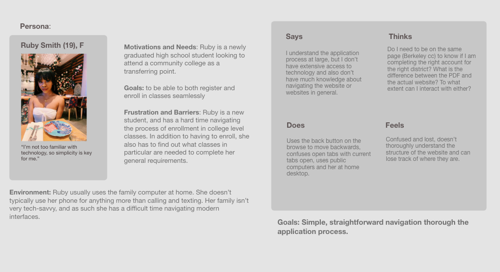
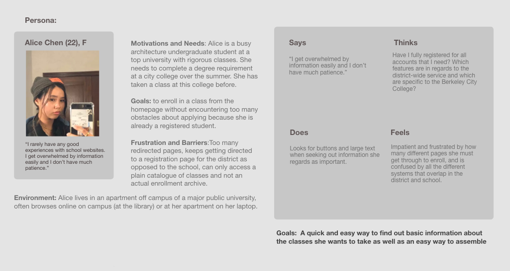
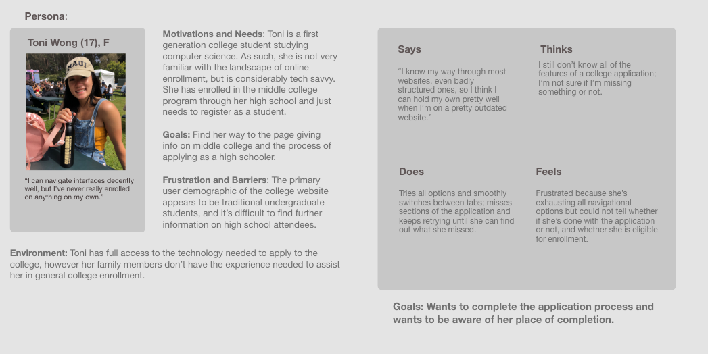
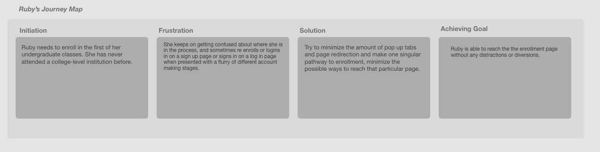
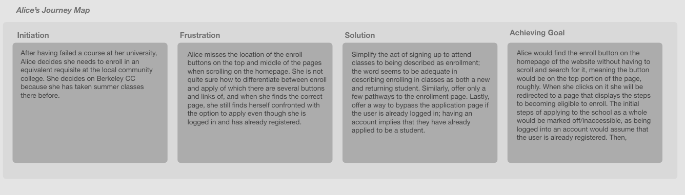
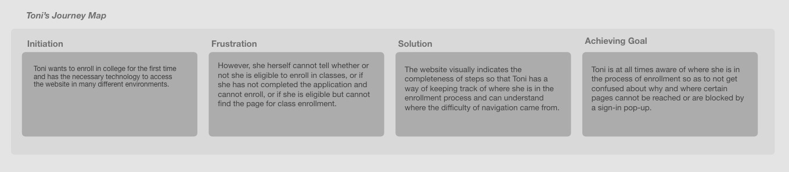

# Assignment 05: Persona + Stories
Megan Mai DH 150
### Features
*** 
##### Main page for the city college of Berkeley, part of Peralta school district.
###### The home page would contain 'enroll' buttons and links dedicated to registration for classes. 
##### Button should lead to a singular page that offers both enrollment + application options for people of varying stages of registration.
###### The registration process page should have a to-do list format, where users are aware of what stage of completion they are at. This way, you can attribute inaccessibility to something other than not having completed the required steps.
##### Clear and simple format to appeal to all audience of varying experience technology.
###### The website must appeal to all audience and as such should resemble any possible analog counterparts.
***
## Persona and Empathy Maps

- Ruby Smith, Persona #1

- Alice Chen, Persona #2

- Toni Wong, Persona #3

## Scenarios and Journey Maps

### Ruby Smith's Scenario

- Ruby is a new high school graduate who needs to enroll in her first year of college at community college. She values cost and time efficiency, hence her enrolling in city college. She does not have much access to technology and thus is often on the website in public spaces like labs or libraries. She is consequently not very tech savvy and cannot navigate websites efficiency, regardless of the design. 

- Ruby is at the library on a public computer when she is trying to enroll at this school. She opens the website up on the homepage and finds the enroll button in the middle of the page. It takes her straight to the enrollment list which is a lengthy horizontal carousel, on each notch of the carousel was an individual "check list". She struggles to find out how to move the carousel; she tries to drag it but eventually sees the arrows pointing to scroll.

### Alice Chen's Scenario
- Alice Chen is a busy third year architect student at the rigorous program at UC Berkeley. She failed a IGETC class her freshman year and must retake the class on campus or at a local city college. She has already enrolled in Berkeley CC and decides to take the class there.
- Alice goes on the home page and finds the enroll button. It directs her to the carousel, which is a series of of checklists starting from step 1. Alice clicks on step one, and gets directed to a page for registering for an account for the Peralta school district, which she has an account for already. She has to backtrack to the carousel and find the enroll in classes tab, which is hidden under a drop-down bar.

### Toni Wong's Scenario 

- Toni Wong is a first generation college student studying computer science. She is not very familiar with the landscape of online enrollment, but is considerably tech savvy. She has enrolled in the middle college program through her high school and just needs to register as a student. Since she has never applied to a college program, and has no family memebers to help her with this, she needs as much assistance and descriptiveness as possible when enrolling online.

- Toni accesses the website from her personal laptop at home. She clicks the enroll button at the center and finds herself at the enrollmetn steps page. She can't tell if this page is for traditional college students or if it applies to her as well. After a frustrating amount of time spent searching, she finds information on middle college students on the fourth notch of the carousel hidden by a drop down bar.

