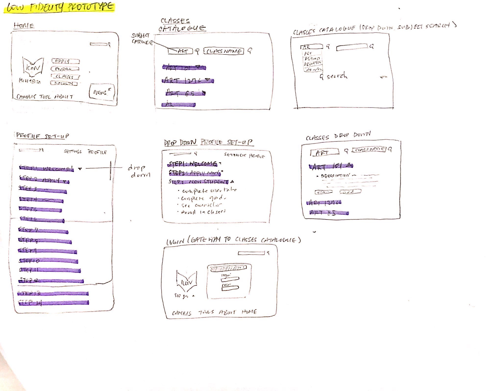
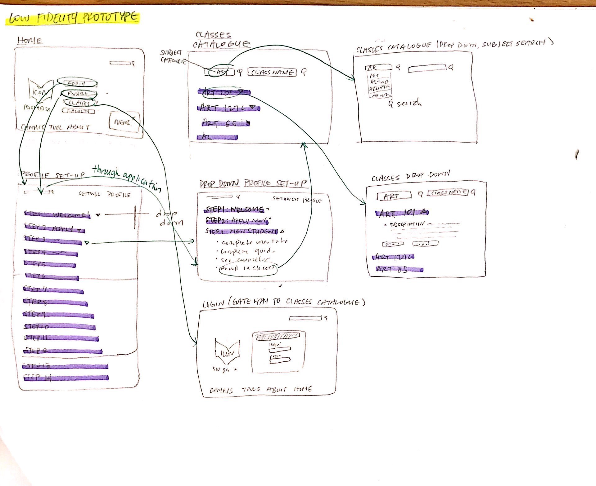
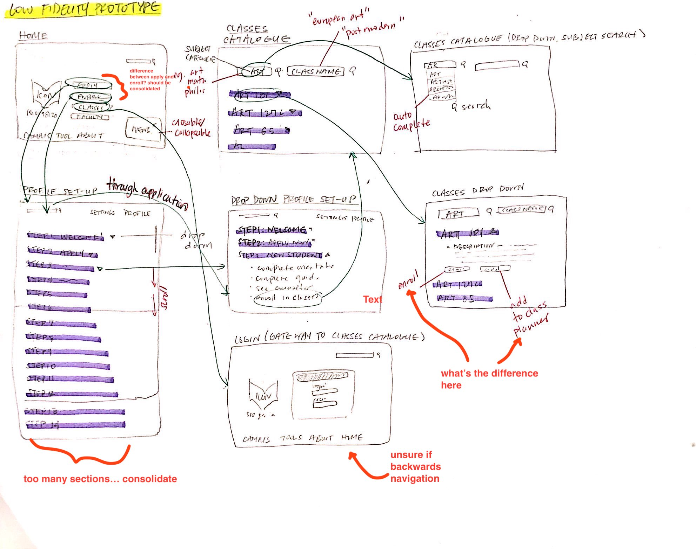

# Assignment 06: Low-fidelity Prototype

### Megan mai 
--------------------

**Description**

###### The website that inspired my project was the Berkeley home page and enrollment feature. One of the primary purposes of the homepage is to direct potential students to resources for enrollment. This is the aspect of the website I decided to focus my critique on. The genesis of the Berkeley City College's issue with the enrollment system is excessive complexity. The research I conducted indicated that this complexity is combination of an overcrowded/busy homepage design and tedious and cyclical navigation path from home page to enrollment page. I found that, given the nature of the city college system, the easiest way to lose potential students is to make the enrollment process, which is mostly done online in this age, needlessly complex and tedious. Therefore, the accessibility of the enrollment process should a priority in construction of such sites.
###### The personas I created were conceptualized to fit the ideal of the user base for the website. First, there was Alice Chen, who is a busy and impatient student at the University nearby. She needs to fufill a general requirement at one of the city colleges. Ruby is a student coming out of high school who is deciding on city colleges to attend as a transferring point. She is turning to junior college as a cost effective alternative to going straight to a four year. She's busy with a full time job and prioritizes time efficiency. Lastly, Toni is a high school student looking to attend middle college during her highschool career. She is inexperienced with enrollment because she has never enrolled in anything on her own before. She also needs to apply before she enrolls.
###### There is a general feature that all of these archetypes would benefit from, and that is the simplification of the process of enrollment. It is an overarching property that both cares for time effifiency, which in turn is a subproperty of monetary wealth. It is likely lower income users have less luxury of time. Lastly, simplying the enrollment path would help inexperienced users complete what seems to a very daunting task.
--------------------
**Tasks**

1. Find enroll button on homepage
2. Find and view catalogue of classes.
3. Apply to attend the school.

--------------------
**Pictures**

--------------------
**Notes**
###### The prototype begins at the homepage of the website, which is cause for the bulk of the issues encountered while running trials with users. The main issue was the relation between terms and differentiating between the two at face value. Users found issue with the terms 'apply' and 'enroll', taking it to be synonomous or too close in meaning to be listed next to each other. My prototype minimized the options on the page but did not rid it of close or conjoined terms. On the profile set-up page, and adapted the carousel layout to be a scroll down layout, which seemed to worsen the length and exaggerate the number of steps needed to create a profile. 
**Overall, the main issues were:**
1. Overcrowded and over extended pages: The profile set up scroll downwards for too long; can have trouble keeping of track of where they are. Better suited for a page by page format.
2. Similar and confusing terminology: options presented are confusing and need to be revised for clarity OR consolidated into one option, such as apply -> already applied? enroll in classes now.

