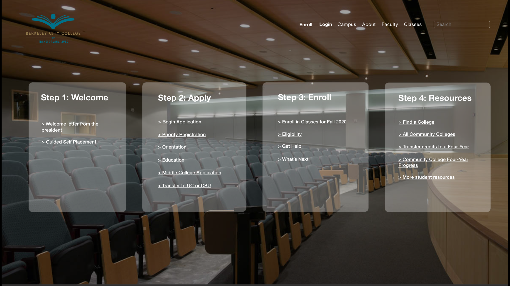
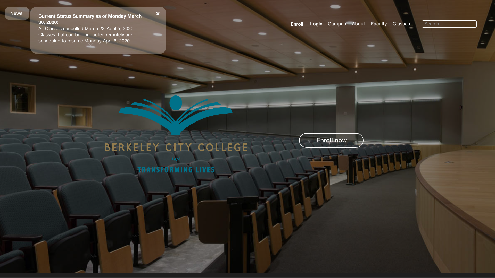
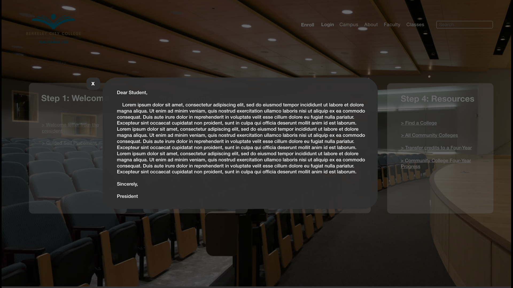
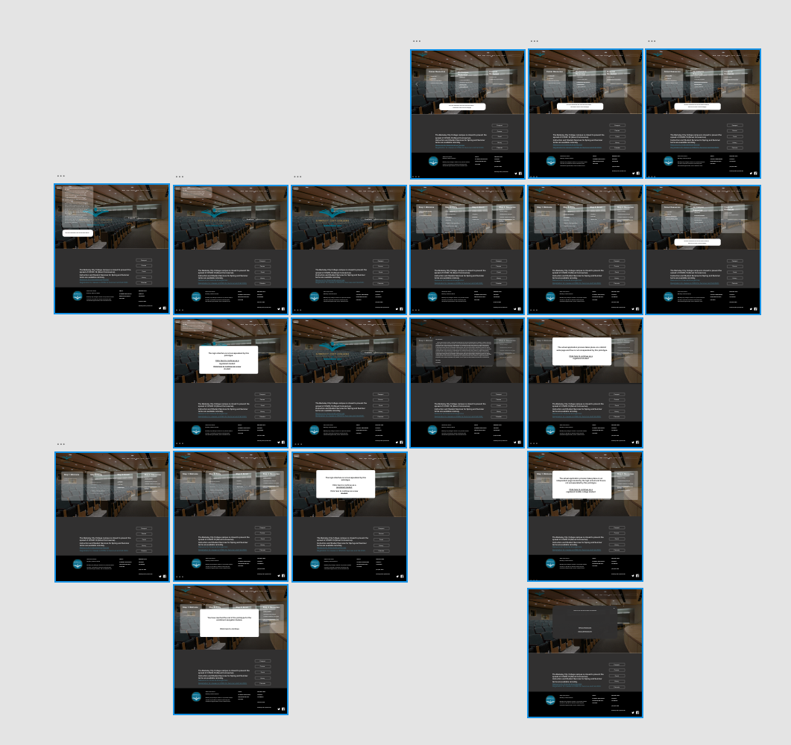
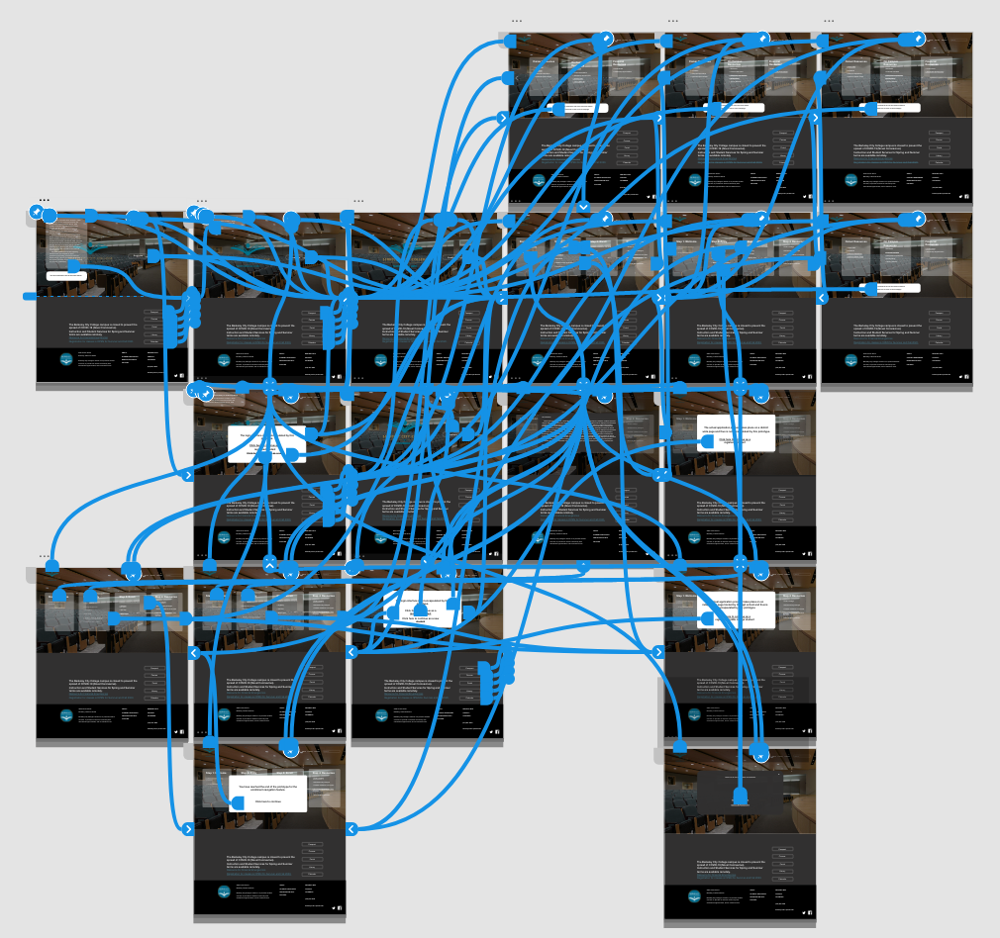
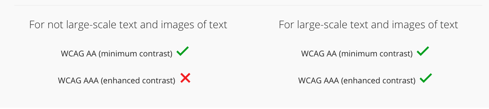
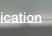
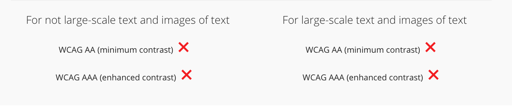
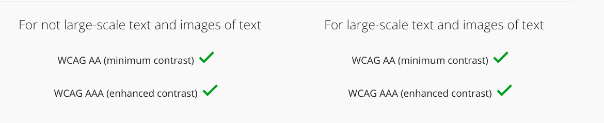
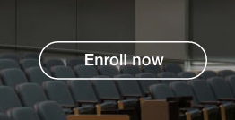

# Assignment 07: High Fideliy Prototype
***Megan Mai / DH 150 / Spring '20***
##### [High-Fidelity Prototype](https://xd.adobe.com/view/14002411-e050-41c9-5051-3215fa9dbe57-6231/)
### Description
- The purpose of this project is to elevate the most relevant features of a college homepage. The vast majority of users visiting
the page are students or prospective students, and as such, one of the primary features to be prioritized is a the enroll-
ment/application process. The enrollment process must take precedence over almost all other functions provided by
page due to both its complexity and its relevance. Subsequently important features would be to access the class catalogue (this is where you would actually enroll in a class), and to enroll in a middle college program. Whether it be to search for classes for already registered students, or to apply to become a student, or to enroll 
in a high school level program, the enrollment feature acts as the mainline of the college page, and it is important that 
it is supported elegantly and is simple to navigate. 
The changes made to this project are inspired by feedback garnered from iterative user testing. 
- The origin of the project stems from independent complaints from peers hailing from a considerably large and relevant user base (students attending nearby university in need of completing undergraduate credits). I based my initial low-fidelity prototype around the feedback, which ultimately cited complexity and data overstimulation on the enrollment page as the primary issue of the prototype. I implemented these ideas by nesting options within eachother instead of presenting all possible routes on the same page, and consolidated the terms 'enroll' and 'apply' under the same 'enroll' button and link, after concluding that enrollment would imply application. All of these changes were considered during the process of developing my high-fidelity prototype in adobe xd.

---------------------
### Tasks
1) Reach the application form.
> In this task, the associated user persona, Ruby, is a new student who has not yet registered as a student and needs to access the application form. She opens the home page of the Berkeley City College website, and sees that the button to enroll, but not apply, is on front and center on the home page. Although this is not quite synonomous to application, there is no other term on the page even remotely related to application process, so she opts to click on the enroll button. She is not particular about this, and assumes enroll encapsulates apply as well. She is redirected to the enroll page, which is a carousel of cards each symbolizing a "step" in the process to application, and subsequently enrollment in classes. Each "card" contains a short to-do list. On the first card, below a welcome letter from the president, is a link to the application form for the CC school district displayed as 'apply'. From there, she is taken to a page with the options undergraduate program, and middle college program. She clicks on the undergraduate student option, and is led to the applicaiton form for a traditional student.
2) Reach the middle college information page.
> In this task, the associated user persona, Toni, is a high school student looking to enroll in the middle college program offered at the school. She begins on the home page of the website, and selects the enroll button on the center of the page as before. She is directed to an enrollment page on which is the carousel of cards. On the first card, under the link to the welcome letter, there is a link for application. From there, she selects the middle college option, leading her to enrollment and subsequently further steps with pages that operate in conjunction with her highschool.
3) Reach the classes catalogue (not to be confused with the pdf of classes, but rather the page from which one can both learn about and enroll in a class). 
> The associated user Persona, Alice, is a student at UC Berkeley. She already has an account with BCC, and knows to click on the enroll button on the homepage already. From there, she finds, on the second or third card on the carousel, an option to enroll in classes- something that is only available to already registered students. The application and welcome cards are out of boundaries for her selection, so she knows that they are not relevant actions.
### Prototype Design
#### Representative Screen Designs

#### Wireflow with Graphic Designs

------------------
### Design Motivation
> I decided to at least maintain the old color scheme of the website. I assumed that these were the school colors (there's no source online that confirms this) so I wanted to make sure the identity of the website maintained intact. I also maintained the card-like navigation offered by the webiste's enrollment, but slightly enlarged them and tried to add some depth and modernity by introducing partially transluscent shapes into the design. I wanted the user to feel as if they are in the same 'place' the entire time they are filling out the enrollment checklist, to mitigate the feeling of being lost or confused by this really long process. Instead, my design aims to make the options and links appear to be the mobile items.  
I also wanted to clear up the home page, so I made a collapsable news tab that is fixed while you scroll.
Since my overall intention was to create a singular path to guide the user with, I didn't want to change the interface between pages too much. I think a big flaw of the original website is that it whisks the user off to too many unfamiliar pages that they then must learn to navigate. I wanted the switch between each artboard to be minute.
------------------
### Design Process/Revision
> I adjusted the opacity and tone my font and backgrounds using a contrast checker online. Since I couldn't use the google chrome tool, I manually entered the hexcodes of the some text/background pairings.
# 
# 
It for the most part passed, however, it is text laid on a photo background. So certain light areas intersect with the text as such:
# 
# 
While other areas perform much better 
# 
# 
------------------
### User Testing 
#### Impression Test
The color scheme is not vibrant (I followed up later making sure that this observation did not have anything to do with contrast and legibility).
###### "This is a very *dull* and *dark* website, but the aesthetic brand is very *consistent*. I can tell this is all from the same company or institution."
(when prompted to offer some adjectives)
###### "This is very *modern* and minimalist looking."
###### "It's not bad but it's a little *boring*. The colors are so *dull* and the whole website looks *barren*"
